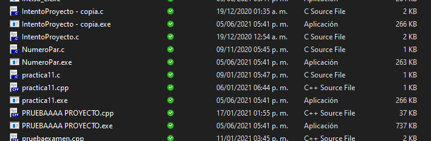
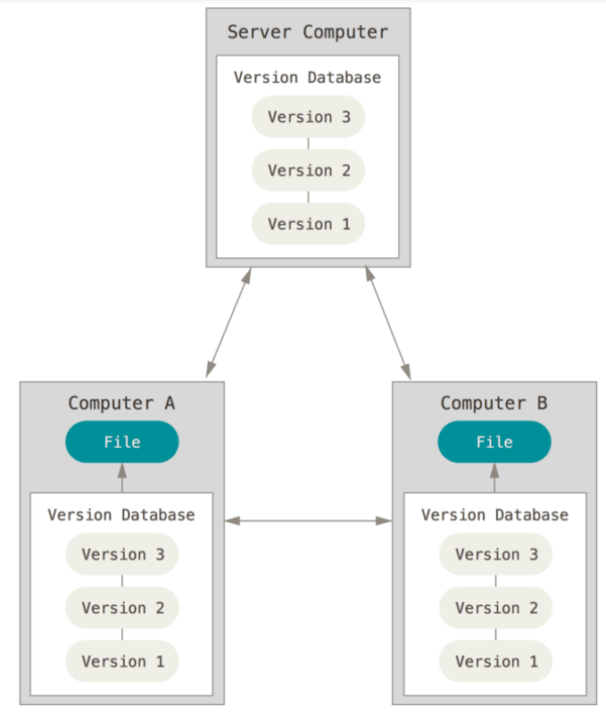

# **Git y GitHub**

### **Indice**

[0. Objetivos](#objetivos)  
[1. Instalación](#1-instalación-y-documentación-de-git)  
[2. Introduccion](#2-introducción)  
[3. Referencias](#referencias) 

[Siguiente subtema](../02_Comandos-basicos/02_Comandos-basicos.md)

### **Objetivos**

- Aprenderás a gestionar las versiones de un proyecto de software a través de los comandos esenciales de git.
- Podrás alojar tu repositorio local en GitHub
- Conocerás los comandos esenciales para el trabajado colaborativo en GitHub

En este curso se usarán los siguientes materiales:
- Git
- Terminal de comandos ***(Git Bash y Terminal de Windows)***
- Editor de código **(Visual Studio Code)**
- Cuenta de GitHub

## **1. Instalación y documentación de Git**
**Para Windows y OSX:** Para instalar Git en tu computadora da [clic aqui](https://git-scm.com/).
- **Para Windows:** Automáticamente se instala el Git Bash
- **Para OSX:** Se abre la terminal y se asegura la version de git que se instaló.

**Para Linux:** Se abre la terminal y se ejecutan los comandos `sudo apt-get update`, después `sudo apt-get install git`. Una vez hecho esto, se puede revisar que se haya instalado correctamente.

***Nota:*** Para asegurarnos de la versión instalada en nuestra computadora se utiliza el comando `git --version`

## **2. Introducción**

### ¿Qué es Git?

- Git es un sistema de control de versiones ***distribuido*** que se utiliza para rastrear los cambios en el código fuente durante el desarrollo de software.

***Fue creado por Linus Torvalds en 2005.***

### ¿Sistema de control de versiones?
- Es un sistema que nos permite saber como va cambiando un conjunto de archivos durante el desarrollo de un proyecto de software. 

- Nos permite saber el contenido exacto de un archivo en un determinado momento.

### ¿Distribuido?

Dentro de un control de versiones se tienen los:
- ***Locales***

- ***Centralizados***
- ***Distribuidos:*** Los clientes no solo descargan la última copia instantánea de los archivos, sino que se replica completamente el repositorio. De esta manera, si un servidor deja de funcionar y estos sistemas estaban colaborando a través de él, cualquiera de los repositorios disponibles en los clientes puede ser copiado al servidor con el fin de restaurarlo.

***Git*** se ha convertido en la elección estándar para el control de versiones en la industria del desarrollo de software y es ampliamente utilizado en proyectos de código abierto y cerrado.

### **Ventajas**

- Puedes trabajar localmente sin conexión a una red
- Integridad
- No puedes perder información o corrupción de archivos sin que Git lo sepa

### **Desventajas**

- Dificultad con archivos binarios

***Nota:*** Un archivo binario es un archivo informático que contiene información de cualquier tipo codificada en binario para el propósito de almacenamiento y procesamiento en ordenadores. 

Por otro lado, los archivos de texto plano son aquellos que contienen solamente información almacenada en formato **ASCII**.

## Referencias

[Referencias en CSV](referencias/ref.csv)