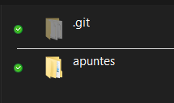
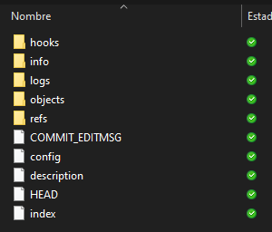

# **Comandos Básicos de Git**

[Ir a Subtema anterior](../01_Introduccion/01_Introduccion.md)

### Indice 

[Configuración de ***Git***](#configuración-de-git)  
[Inicializar un repositorio local](#inicializar-un-repositorio-local)  
[Directorio ***.git***](#directorio-git)  
[Los tres estados (staged, modified, comitted)](#los-tres-estados-staged-modified-comitted)  

## Configuración de GIT

Antes de usar ***Git*** debemos indicarle quienes somos. Esto lo podemos hacer gracias al comando `git config`.

El comando ***git config*** anterior te permite establecer variables de configuración que controlan el aspecto y funcionamiento de Git en tu computadora.

***Nota:*** Esta configuración solo se hace la primera vez que configuras **Git** en tu computadora. Solo es necesario volver a establecer los valores cuando quieras hacer un cambio específico (***correo, alias, etc***).

### Configuración de identidad

A continuación vamos a configurar nuestro nombre y nuestro email.

***Ejemplo:***  
- **Nombre:**
```bash
git config --global user.name "Aldo Santiago"
```
- **Email:**
```bash
git config --global user.name "correo@dominio.com"
```

Puedes comprobar la configuración usando `git config user.name` o la variable de configuración que desees.

## Inicializar un repositorio local

Para crear un repositorio se escribe el comando `git init` en el directorio en el que te encuentras.

Una vez hecho eso, verás que se crea un directorio oculto llamado ***.git***. 



## Directorio ***.git***

Esta carpeta es la más importante de todo ***git*** puesto que almacena todos los metadatos y la base de datos de objetos para tu proyecto. 



Toda esta carpeta es la que se copia cuando clonas un repositorio desde otra computadora al hacer `git clone`.

## Los Tres Estados (***staged, modified, comitted***)

En ***Git***, existen tres estados principales en los que se pueden encontrar tus archivos:
- Confirmado (***comitted***): Los archivos están almacenados correctamente en tu base de datos local. 
- Modificado (***Modified***): El archivo ha sido modificado pero aún no está almacenado en la base de datos.
- Preparado (**staged**): El archivo está listo para ser confirmado.

---
**El flujo de trabajo básico en Git es algo así:** 
1. Modificas una serie de archivos en tu directorio.
2. Preparas los archivos, añadiendolos a tu área de preparación.
3. Confirmas los cambios, lo que toma los archivos tal y como están en el área de preparación y almacena esa copia instantánea de manera permanente en tu directorio de Git.
> Según Pro Git (p. 22)
---

## Comando ***add***, **status** y **commit**.